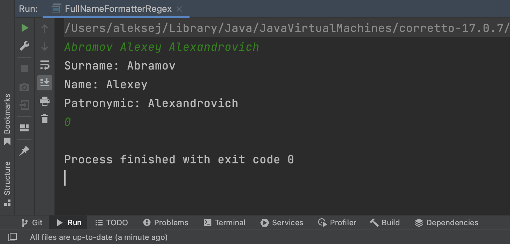
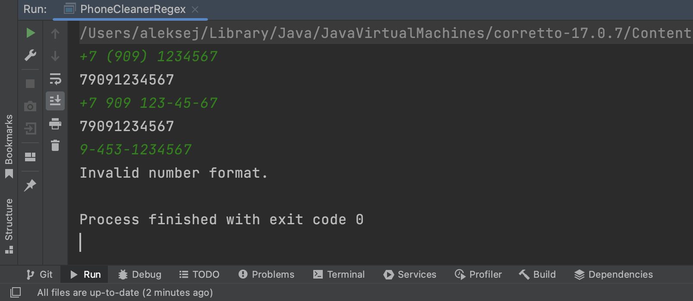
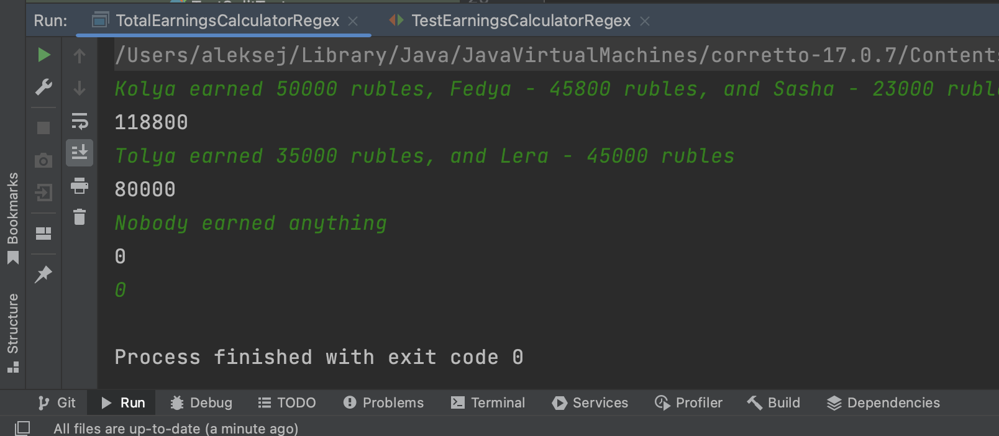

# StringsAndRegex 

A project to practice working with strings and simple regular expressions.

____

### FullNameFormatterRegex

This class splits the string into the last name, first name and patronymic and checks the content of Russian letters in it.

____

### PhoneCleanerRegex

This class cleans up the number and converts it to the Russian format.

____

### SplitText

This class splits text into words.

____

### TotalEarningsCalculatorRegex

This class does the calculation of the sum of earnings of all friends using regular expressions.

